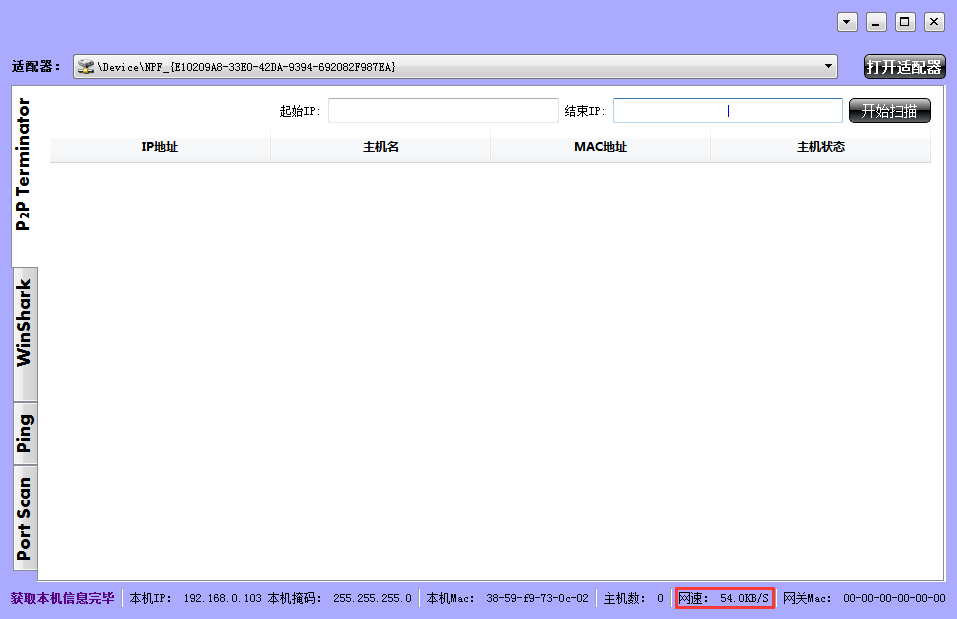

# SnifferToolServer

# 网络管理工具

&emsp;&emsp;The Sniffer Tool based on WinPcap and QT5.

&emsp;&emsp;基于WinPcap和QT5开发的网络管理工具。

# Main Interface
# 主界面

# Functions
# 主功能

- Host Scan
- **主机扫描**
- ARP Attack
- **ARP 攻击**
- Packet Filter
- **过滤抓包**
- Traffic Statistic
- **实时网速，流量统计**
- Ping Function
- **Ping 功能**
- Port Scan 
- **端口扫描**

# 功能一：主机信息扫描

# 功能二：局域网主机扫描

# 功能三：ARP 攻击

#功能四：过滤抓包

# 功能五：Ping功能

# 功能六：端口扫描功能

# 功能七：实时网速显示

